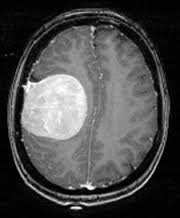

# 🧠 Brain Tumor Detection using CNN

This project uses a Convolutional Neural Network (CNN) to detect brain tumors from MRI images. The model is built with TensorFlow and trained on a dataset of labeled brain scans (`yes` for tumor, `no` for no tumor).

---
brain_tumor_detection/
│
├── brain_tumor_dataset/                 # Contains the dataset with 'yes' and 'no' subfolders
│   ├── yes/                             # MRI scans with brain tumors
│   └── no/                              # MRI scans without brain tumors
│
├── visuals/                             # Stores all generated visuals and plots
│   ├── Brain MRI Images Samples.png
│   ├── Brain Tumor Confusion Matrix.png
│   ├── No Tumor Detection.png
│   ├── Training vs Validation Accuracy & Loss.png
│   └── Tumor Detection.png
│
├── venv/                                # Python virtual environment (for dependencies)
│
├── .gitignore                           # Specifies intentionally untracked files to ignore
├── requirements.txt                     # List of required Python packages
├── BRAIN-TUMOR-DETECTION.ipynb          # Main Jupyter Notebook with training and testing code
└── README.md                            # Project documentation and usage instructions


---

Install dependencies:

```bash
pip install -r requirements.txt
```

Or manually install:

```bash
pip install tensorflow numpy opencv-python matplotlib scikit-learn seaborn
```

---

## 🚀 How to Run

1. Clone the repo  
2. Activate the virtual environment  
3. Launch Jupyter Notebook  

```bash
jupyter notebook
```

4. Open `BRAIN-TUMOR-DETECTION.ipynb` and run all cells step-by-step.

---

## 📊 Features

- 📥 Image Preprocessing (resizing, normalization)  
- 🧠 CNN Model built with:  
  - Conv2D, MaxPooling2D  
  - Flatten, Dense, Dropout  
- 📈 Training with train/test split  
- 📉 Evaluation with classification report and confusion matrix  
- 🖼️ Custom image prediction  


---

## ✅ Output Example

```
🧠 Prediction: Tumor Detected (Yes)
```

---

## 📷 Prediction on Sample Image




> This image was used for prediction and classified as having a brain tumor.
